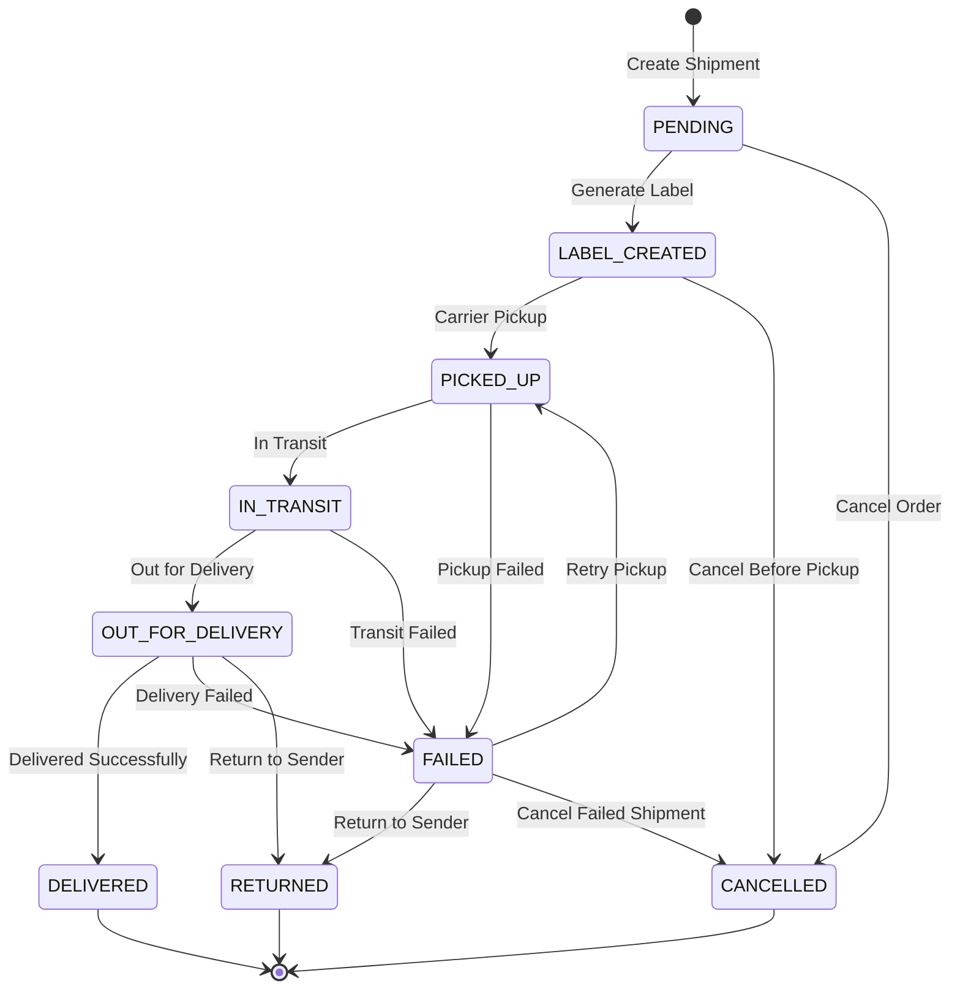

# Shipping Service

## Overview

The Shipping Service manages all aspects of shipping operations for the e-commerce platform, including carriers, rates, shipping methods, shipments, packages, and tracking. It provides comprehensive APIs for shipping rate calculations, label generation, shipment tracking, and carrier integration.

## Key Features

- **Multi-Carrier Integration**: Support for various shipping carriers (UPS, FedEx, DHL, etc.)
- **Rate Calculation**: Dynamic shipping rate calculation based on dimensions, weight, distance
- **Shipping Zones**: Geographic zone management for regional shipping
- **Shipping Methods**: Various shipping options with different delivery timeframes
- **Shipment Management**: Complete shipment lifecycle handling
- **Tracking**: Real-time shipment tracking and status updates
- **Label Generation**: Shipping label creation and management
- **Package Handling**: Multiple package management per shipment
- **Webhooks**: Processing of carrier webhook notifications for status updates
- **Regional Support**: Region-specific shipping options and carriers

## Technical Stack

- Spring Boot 3.x
- Spring Data JPA
- Spring Cloud (Eureka, OpenFeign, Circuit Breakers)
- PostgreSQL/CockroachDB for data persistence
- Redis for caching
- Resilience4j for fault tolerance
- JSON Web Tokens (JWT) for security

## Project Structure

- `/src/main/java/com/winnguyen1905/shipping/`
  - `/config/`: Configuration classes
  - `/core/`: Core business logic
    - `/controller/`: REST controllers
    - `/service/`: Service implementations
    - `/model/`: Domain models and DTOs
  - `/exception/`: Exception handling
  - `/persistance/`: Data access layer
    - `/entity/`: JPA entities
    - `/repository/`: JPA repositories
  - `/service/`: Additional services
  - `/util/`: Utility classes

## Shipping Lifecycle



## API Endpoints

### Carrier Management

- `POST /api/v1/carriers`: Create carrier
- `GET /api/v1/carriers/{id}`: Get carrier by ID
- `PUT /api/v1/carriers/{id}`: Update carrier
- `DELETE /api/v1/carriers/{id}`: Delete carrier
- `POST /api/v1/carriers/{id}/test-connection`: Test carrier connection

### Shipping Methods

- `POST /api/v1/shipping-methods`: Create shipping method
- `GET /api/v1/shipping-methods/{id}`: Get shipping method by ID
- `PUT /api/v1/shipping-methods/{id}`: Update shipping method
- `DELETE /api/v1/shipping-methods/{id}`: Delete shipping method
- `GET /api/v1/shipping-methods`: List shipping methods
- `GET /api/v1/shipping-methods/carrier/{carrierId}`: Get methods by carrier
- `GET /api/v1/shipping-methods/zone/{zoneId}`: Get methods by zone

### Shipping Zones

- `POST /api/v1/zones`: Create shipping zone
- `GET /api/v1/zones/{id}`: Get zone by ID
- `PUT /api/v1/zones/{id}`: Update zone
- `DELETE /api/v1/zones/{id}`: Delete zone
- `GET /api/v1/zones`: List zones
- `GET /api/v1/zones/lookup`: Lookup zone by address

### Rate Calculation

- `POST /api/v1/rates/calculate`: Calculate shipping rates
- `POST /api/v1/rates/quick-estimate`: Quick rate estimate
- `GET /api/v1/rates/compare`: Compare rates across carriers

### Shipment Management

- `POST /api/v1/shipments`: Create shipment
- `GET /api/v1/shipments/{id}`: Get shipment by ID
- `PUT /api/v1/shipments/{id}`: Update shipment
- `DELETE /api/v1/shipments/{id}`: Cancel shipment
- `GET /api/v1/shipments`: List shipments
- `GET /api/v1/shipments/order/{orderId}`: Get shipments by order
- `POST /api/v1/shipments/{id}/generate-label`: Generate shipping label
- `POST /api/v1/shipments/{id}/ship`: Mark as shipped

### Package Management

- `POST /api/v1/packages`: Create package
- `GET /api/v1/packages/{id}`: Get package by ID
- `PUT /api/v1/packages/{id}`: Update package
- `DELETE /api/v1/packages/{id}`: Delete package
- `GET /api/v1/packages`: List packages
- `GET /api/v1/packages/shipment/{shipmentId}`: Get packages by shipment

### Tracking

- `GET /api/v1/tracking/{trackingNumber}`: Track by tracking number
- `GET /api/v1/tracking/shipment/{shipmentId}`: Track shipment
- `POST /api/v1/tracking/refresh/{trackingNumber}`: Refresh tracking
- `GET /api/v1/tracking/number/{trackingNumber}/events`: Get tracking events

### Webhook Management

- `POST /api/v1/webhooks/receive/{carrierCode}`: Receive carrier webhooks
- `GET /api/v1/webhooks/unprocessed`: Get unprocessed webhooks
- `POST /api/v1/webhooks/{id}/process`: Process webhook
- `POST /api/v1/webhooks/process-all-unprocessed`: Process all unprocessed webhooks

## Service Types

The shipping service supports multiple service types with different delivery timeframes:

- **STANDARD**: Regular ground shipping (3-5 business days)
- **EXPRESS**: Expedited shipping (2-3 business days)
- **OVERNIGHT**: Next-day delivery (1 business day)
- **SAME_DAY**: Same-day delivery
- **ECONOMY**: Budget shipping (5-7 business days)

## Integration with Other Services

The Shipping Service integrates with several other microservices:

- **Order Service**: Updates order status based on shipping progress
- **Customer Service**: Retrieves customer address information
- **Product Service**: Gets product dimensions and weight for shipping calculations
- **Inventory Service**: Coordinates with warehouse locations
- **Payment Service**: Handles shipping fee calculations and refunds
- **Notification Service**: Sends shipping updates to customers

## Database Schema

The service uses the following main tables:

- **shipping_carriers**: Carrier information and configuration
- **shipping_zones**: Geographic shipping zones
- **shipping_methods**: Available shipping methods per carrier and zone
- **shipments**: Shipment details and status
- **shipment_items**: Items included in shipments
- **shipment_packages**: Packages within a shipment
- **shipment_tracking_events**: Tracking events for shipments
- **shipping_rate_calculations**: Rate calculation history
- **shipping_webhooks**: Webhook data from carriers

## Getting Started

### Prerequisites

- Java 21
- Maven 3.8+
- PostgreSQL/CockroachDB
- Docker and Docker Compose (optional)

### Setup

1. Configure database connection in `application.yaml`
2. Initialize database with schema:
   ```bash
   cat src/main/resources/shipping_service_sql.sql | psql -U postgres
   ```
3. Run the application:
   ```bash
   mvn spring-boot:run
   ```

### Docker

```bash
# Build Docker image
docker build -t shipping-service .

# Run with Docker
docker run -p 8085:8085 shipping-service

# Run with Docker Compose
docker-compose up -d
```

## Documentation

- Swagger UI: `/swagger-ui.html` (when application is running)
- Database schema: See `src/main/resources/shipping_service_sql.sql`
