# Shipping Service 🚚

A comprehensive microservice for managing shipping operations, including carriers, zones, methods, shipments, and tracking.

## 🏗️ Architecture Overview

This service follows a clean architecture pattern with comprehensive JPA entities and repositories for all shipping-related operations. The codebase is organized with a common layer containing shared enums, constants, and utilities for better maintainability and reusability.

## 🎯 System Architecture Flow

```mermaid
graph TB
    Client[🌐 Client Applications] --> API[🔌 REST API Layer]
    API --> Controller[🎮 Controllers]
    Controller --> Service[⚙️ Service Layer]
    Service --> Repository[🗄️ Repository Layer]
    Repository --> Database[(💾 Database)]
    
    Service --> Validation[✅ Validation Utils]
    Service --> Exception[❌ Exception Handling]
    Service --> Security[🔐 Security Layer]
    
    External[📡 External Carriers] --> Webhook[🔗 Webhook Endpoints]
    Webhook --> Service
    
    subgraph "🏢 Business Logic"
        Service --> Carrier[🚛 Carrier Service]
        Service --> Zone[🌍 Zone Service]
        Service --> Method[📋 Method Service]
        Service --> Shipment[📦 Shipment Service]
        Service --> Tracking[📍 Tracking Service]
        Service --> Rate[💰 Rate Service]
        Service --> Package[📮 Package Service]
        Service --> Webhook_Svc[🔔 Webhook Service]
        Service --> Report[📊 Report Service]
    end
    
    style Client fill:#e1f5fe
    style API fill:#f3e5f5
    style Service fill:#e8f5e8
    style Database fill:#fff3e0
```



## 📊 Database Schema

The service manages the following main entities:

### 🎯 Core Entity Relationship Diagram


## 🔄 Shipment Lifecycle Flow

```mermaid
stateDiagram-v2
    [*] --> PENDING : 📝 Create Shipment
    
    PENDING --> LABEL_CREATED : 🏷️ Generate Label
    PENDING --> CANCELLED : ❌ Cancel Order
    
    LABEL_CREATED --> PICKED_UP : 📋 Carrier Pickup
    LABEL_CREATED --> CANCELLED : ❌ Cancel Before Pickup
    
    PICKED_UP --> IN_TRANSIT : 🚛 In Transit
    PICKED_UP --> FAILED : ⚠️ Pickup Failed
    
    IN_TRANSIT --> OUT_FOR_DELIVERY : 🚚 Out for Delivery
    IN_TRANSIT --> FAILED : ⚠️ Transit Failed
    
    OUT_FOR_DELIVERY --> DELIVERED : ✅ Delivered Successfully
    OUT_FOR_DELIVERY --> FAILED : ⚠️ Delivery Failed
    OUT_FOR_DELIVERY --> RETURNED : 📮 Return to Sender
    
    FAILED --> PICKED_UP : 🔄 Retry Pickup
    FAILED --> RETURNED : 📮 Return to Sender
    FAILED --> CANCELLED : ❌ Cancel Failed Shipment
    
    DELIVERED --> [*] : 🎉 Process Complete
    CANCELLED --> [*] : ❌ Process Terminated
    RETURNED --> [*] : 📮 Return Complete
    
    note right of PENDING
        🔄 Initial State
        Ready for processing
    end note
    
    note right of DELIVERED
        🎯 Success State
        Package delivered
        Signature captured
    end note
    
    note right of FAILED
        ⚠️ Error State
        Requires intervention
        Can be retried
    end note
```



## 🚀 API Flow Diagram

```mermaid
graph TD
    Start([🚀 Client Request]) --> Auth{🔐 Authentication}
    Auth -->|✅ Valid| Validate[📋 Request Validation]
    Auth -->|❌ Invalid| AuthError[🚫 401 Unauthorized]
    
    Validate -->|✅ Valid| Business[⚙️ Business Logic]
    Validate -->|❌ Invalid| ValidationError[📛 400 Bad Request]
    
    Business --> Database[(💾 Database Operation)]
    Database -->|✅ Success| Response[📤 Success Response]
    Database -->|❌ Error| DBError[💥 500 Server Error]
    
    Business -->|🔍 Rate Calculation| RateLogic[💰 Rate Calculation Engine]
    Business -->|📦 Shipment Creation| ShipmentLogic[📦 Shipment Processing]
    Business -->|📍 Tracking| TrackingLogic[📍 Tracking Engine]
    Business -->|🔔 Webhook| WebhookLogic[🔔 Webhook Processing]
    
    RateLogic --> ZoneMatch[🌍 Zone Matching]
    ZoneMatch --> CarrierRates[🚛 Carrier Rate Lookup]
    CarrierRates --> BestRate[🎯 Best Rate Selection]
    
    ShipmentLogic --> ItemValidation[📋 Item Validation]
    ItemValidation --> PackageCreation[📮 Package Creation]
    PackageCreation --> LabelGeneration[🏷️ Label Generation]
    
    TrackingLogic --> EventCreation[📝 Event Creation]
    EventCreation --> StatusUpdate[🔄 Status Update]
    StatusUpdate --> Notification[📧 Notification]
    
    WebhookLogic --> WebhookValidation[✅ Webhook Validation]
    WebhookValidation --> DataProcessing[⚙️ Data Processing]
    DataProcessing --> AutoUpdate[🔄 Auto Status Update]
    
    Response --> End([✨ Response Sent])
    AuthError --> End
    ValidationError --> End
    DBError --> End
    
    style Start fill:#e1f5fe
    style Auth fill:#f3e5f5
    style Business fill:#e8f5e8
    style Database fill:#fff3e0
    style End fill:#f1f8e9
```



## 📈 Business Process Flow

```mermaid
graph TB
    Customer[👤 Customer Places Order] --> OrderSys[🛒 Order System]
    OrderSys --> ShippingReq[📦 Shipping Request]
    
    ShippingReq --> RateCalc[💰 Rate Calculation]
    RateCalc --> ZoneLookup[🌍 Zone Lookup]
    ZoneLookup --> CarrierSelect[🚛 Carrier Selection]
    CarrierSelect --> MethodSelect[📋 Method Selection]
    
    MethodSelect --> CreateShipment[📦 Create Shipment]
    CreateShipment --> GenerateLabel[🏷️ Generate Label]
    GenerateLabel --> CarrierAPI[📡 Carrier API Call]
    
    CarrierAPI --> PickupSchedule[📅 Schedule Pickup]
    PickupSchedule --> TrackingNumber[🔢 Generate Tracking#]
    TrackingNumber --> CustomerNotify[📧 Notify Customer]
    
    CustomerNotify --> CarrierPickup[🚚 Carrier Pickup]
    CarrierPickup --> Transit[🛣️ In Transit]
    Transit --> Tracking[📍 Real-time Tracking]
    
    Tracking --> Delivery[🏠 Delivery Attempt]
    Delivery -->|✅ Success| Delivered[📮 Delivered]
    Delivery -->|❌ Failed| RetryDelivery[🔄 Retry Delivery]
    
    RetryDelivery --> Delivery
    RetryDelivery -->|Max Attempts| Return[📮 Return to Sender]
    
    Delivered --> Signature[✍️ Capture Signature]
    Signature --> Complete[🎉 Process Complete]
    
    subgraph "📊 Analytics & Reporting"
        Complete --> Analytics[📈 Performance Analytics]
        Analytics --> CarrierPerf[🚛 Carrier Performance]
        Analytics --> ZoneAnalytics[🌍 Zone Analytics]
        Analytics --> RevAnalytics[💰 Revenue Analytics]
    end
    
    subgraph "🔔 Webhook Processing"
        CarrierAPI --> WebhookReceive[📨 Receive Webhooks]
        WebhookReceive --> WebhookProcess[⚙️ Process Webhooks]
        WebhookProcess --> AutoStatusUpdate[🔄 Auto Status Update]
        AutoStatusUpdate --> CustomerUpdate[📱 Customer Update]
    end
    
    style Customer fill:#e3f2fd
    style Complete fill:#e8f5e8
    style Analytics fill:#fff3e0
```



## 🛠️ Service Architecture

```mermaid
graph LR
    subgraph "🎮 Controller Layer"
        CarrierCtrl[🚛 Carrier Controller]
        ShipmentCtrl[📦 Shipment Controller]
        TrackingCtrl[📍 Tracking Controller]
        RateCtrl[💰 Rate Controller]
        ZoneCtrl[🌍 Zone Controller]
        MethodCtrl[📋 Method Controller]
        PackageCtrl[📮 Package Controller]
        WebhookCtrl[🔔 Webhook Controller]
        ReportCtrl[📊 Report Controller]
    end
    
    subgraph "⚙️ Service Layer"
        CarrierSvc[🚛 CarrierService]
        ShipmentSvc[📦 ShipmentService]
        TrackingSvc[📍 TrackingService]
        RateSvc[💰 RateCalculationService]
        ZoneSvc[🌍 ZoneService]
        MethodSvc[📋 ShippingMethodService]
        PackageSvc[📮 PackageService]
        WebhookSvc[🔔 WebhookService]
        ReportSvc[📊 ReportsService]
    end
    
    subgraph "🗄️ Repository Layer"
        CarrierRepo[(🚛 Carrier Repository)]
        ShipmentRepo[(📦 Shipment Repository)]
        TrackingRepo[(📍 Tracking Repository)]
        RateRepo[(💰 Rate Repository)]
        ZoneRepo[(🌍 Zone Repository)]
        MethodRepo[(📋 Method Repository)]
        PackageRepo[(📮 Package Repository)]
        WebhookRepo[(🔔 Webhook Repository)]
    end
    
    CarrierCtrl --> CarrierSvc
    ShipmentCtrl --> ShipmentSvc
    TrackingCtrl --> TrackingSvc
    RateCtrl --> RateSvc
    ZoneCtrl --> ZoneSvc
    MethodCtrl --> MethodSvc
    PackageCtrl --> PackageSvc
    WebhookCtrl --> WebhookSvc
    ReportCtrl --> ReportSvc
    
    CarrierSvc --> CarrierRepo
    ShipmentSvc --> ShipmentRepo
    TrackingSvc --> TrackingRepo
    RateSvc --> RateRepo
    ZoneSvc --> ZoneRepo
    MethodSvc --> MethodRepo
    PackageSvc --> PackageRepo
    WebhookSvc --> WebhookRepo
    
    style CarrierCtrl fill:#e1f5fe
    style ShipmentCtrl fill:#e8f5e8
    style TrackingCtrl fill:#fff3e0
```



## 🎯 Key Features Overview

```mermaid
mindmap
  root((🚚 Shipping Service))
    🚛 Multi-Carrier Support
      UPS Integration
      FedEx Integration  
      DHL Integration
      USPS Integration
      Custom Carriers
    📦 Shipment Management
      Create Shipments
      Track Packages
      Generate Labels
      Status Updates
      Delivery Confirmation
    💰 Rate Calculation
      Zone-based Pricing
      Weight Calculations
      Service Type Rates
      Insurance Costs
      Bulk Discounts
    🌍 Geographic Zones
      Country Coverage
      State/Province Rules
      ZIP Code Restrictions
      Zone Optimization
    📊 Analytics & Reports
      Performance Metrics
      Revenue Analytics
      Carrier Comparison
      Trend Analysis
      Customer Insights
    🔔 Real-time Updates
      Webhook Processing
      Status Notifications
      Tracking Events
      Exception Handling
    🔐 Enterprise Features
      Security & Auth
      API Rate Limiting
      Audit Logging
      Error Handling
      Scalability
```



## 📡 API Endpoints Overview

### 🚛 Carrier Management APIs
- `POST /api/v1/carriers` - ➕ Create Carrier
- `GET /api/v1/carriers/{id}` - 🔍 Get Carrier
- `PUT /api/v1/carriers/{id}` - ✏️ Update Carrier
- `DELETE /api/v1/carriers/{id}` - 🗑️ Delete Carrier
- `POST /api/v1/carriers/{id}/test-connection` - 🔗 Test Connection

### 📦 Shipment Management APIs
- `POST /api/v1/shipments` - 📝 Create Shipment
- `GET /api/v1/shipments/{id}` - 📋 Get Shipment Details
- `PUT /api/v1/shipments/{id}` - ✏️ Update Shipment
- `POST /api/v1/shipments/{id}/generate-label` - 🏷️ Generate Label
- `POST /api/v1/shipments/{id}/ship` - 🚚 Mark as Shipped
- `GET /api/v1/shipments/tracking/{trackingNumber}` - 📍 Track Package

### 💰 Rate Calculation APIs
- `POST /api/v1/rates/calculate` - 🧮 Calculate Rates
- `POST /api/v1/rates/quick-estimate` - ⚡ Quick Estimate
- `POST /api/v1/rates/bulk-calculate` - 📊 Bulk Calculate
- `GET /api/v1/rates/compare` - 🔄 Compare Rates

### 📊 Reports & Analytics APIs
- `GET /api/v1/reports/shipping-overview` - 📈 Shipping Overview
- `GET /api/v1/reports/carrier-performance` - 🚛 Carrier Performance
- `GET /api/v1/reports/revenue-analytics` - 💰 Revenue Analytics
- `GET /api/v1/reports/operational-metrics` - ⚙️ Operational Metrics

## 🏆 Service Types

```mermaid
graph LR
    subgraph "🚚 Shipping Service Types"
        Standard[📦 STANDARD<br/>Regular ground shipping<br/>3-5 business days<br/>💰 Most economical]
        Express[⚡ EXPRESS<br/>Expedited shipping<br/>2-3 business days<br/>💰💰 Balanced option]
        Overnight[🌙 OVERNIGHT<br/>Next-day delivery<br/>1 business day<br/>💰💰💰 Premium]
        SameDay[🏃 SAME_DAY<br/>Same-day delivery<br/>Same day<br/>💰💰💰💰 Ultra premium]
        Economy[🐌 ECONOMY<br/>Budget shipping<br/>5-7 business days<br/>💰 Budget option]
    end
    
    Standard --> Features1[✅ Ground transport<br/>📦 Standard packaging<br/>📍 Basic tracking]
    Express --> Features2[✅ Air transport<br/>📦 Priority handling<br/>📍 Enhanced tracking]
    Overnight --> Features3[✅ Air express<br/>📦 Priority packaging<br/>📍 Real-time tracking<br/>📞 Delivery alerts]
    SameDay --> Features4[✅ Local courier<br/>📦 Special handling<br/>📍 Live tracking<br/>📞 SMS updates<br/>✍️ Signature required]
    Economy --> Features5[✅ Ground transport<br/>📦 Basic packaging<br/>📍 Limited tracking]
    
    style Standard fill:#e8f5e8
    style Express fill:#fff3e0
    style Overnight fill:#e3f2fd
    style SameDay fill:#fce4ec
    style Economy fill:#f3e5f5
```



## 🔄 Status Tracking Flow

```mermaid
gitgraph
    commit id: "📝 PENDING"
    branch labelCreated
    checkout labelCreated
    commit id: "🏷️ LABEL_CREATED"
    
    branch pickedUp
    checkout pickedUp
    commit id: "📋 PICKED_UP"
    
    branch inTransit
    checkout inTransit
    commit id: "🚛 IN_TRANSIT"
    
    branch outForDelivery
    checkout outForDelivery
    commit id: "🚚 OUT_FOR_DELIVERY"
    
    branch delivered
    checkout delivered
    commit id: "✅ DELIVERED"
    
    checkout labelCreated
    branch cancelled
    commit id: "❌ CANCELLED"
    
    checkout inTransit
    branch failed
    commit id: "⚠️ FAILED"
    
    checkout outForDelivery
    branch returned
    commit id: "📮 RETURNED"
```

## 🛡️ Security & Validation

```mermaid
graph TD
    Request[📥 Incoming Request] --> AuthCheck{🔐 Authentication}
    AuthCheck -->|✅ Valid| AuthzCheck{👮 Authorization}
    AuthCheck -->|❌ Invalid| Reject401[🚫 401 Unauthorized]
    
    AuthzCheck -->|✅ Authorized| InputValidation[📋 Input Validation]
    AuthzCheck -->|❌ Forbidden| Reject403[🚫 403 Forbidden]
    
    InputValidation --> WeightCheck[⚖️ Weight Validation]
    InputValidation --> AddressCheck[🏠 Address Validation]
    InputValidation --> RateCheck[💰 Rate Validation]
    InputValidation --> StatusCheck[📊 Status Validation]
    
    WeightCheck -->|❌ Invalid| Reject400[📛 400 Bad Request]
    AddressCheck -->|❌ Invalid| Reject400
    RateCheck -->|❌ Invalid| Reject400
    StatusCheck -->|❌ Invalid| Reject400
    
    WeightCheck -->|✅ Valid| BusinessLogic[⚙️ Business Logic]
    AddressCheck -->|✅ Valid| BusinessLogic
    RateCheck -->|✅ Valid| BusinessLogic
    StatusCheck -->|✅ Valid| BusinessLogic
    
    BusinessLogic --> Success[✅ Success Response]
    BusinessLogic -->|💥 Error| Reject500[💥 500 Server Error]
    
    style Request fill:#e1f5fe
    style Success fill:#e8f5e8
    style Reject401 fill:#ffebee
    style Reject403 fill:#ffebee
    style Reject400 fill:#fff3e0
    style Reject500 fill:#fce4ec
```



## 🎪 Complete RESTful API Coverage

The shipping service provides comprehensive RESTful APIs covering all aspects of shipping operations:

### 1. Shipment Management APIs (`/api/v1/shipments`)

**Core Operations:**
- `POST /` - Create new shipment with items and packages
- `GET /{id}` - Retrieve shipment details
- `PUT /{id}` - Update shipment information
- `DELETE /{id}` - Cancel shipment (soft delete)
- `GET /` - List shipments with filtering (status, carrier, tracking number)

**Lifecycle Management:**
- `POST /{id}/generate-label` - Generate shipping label
- `POST /{id}/ship` - Mark shipment as shipped
- `POST /{id}/deliver` - Mark shipment as delivered with signature
- `GET /{id}/events` - Get shipment tracking events

**Tracking & Search:**
- `GET /order/{orderId}` - Get shipments by order ID
- `GET /tracking/{trackingNumber}` - Track shipment by tracking number

### 2. Carrier Management APIs (`/api/v1/carriers`)

**CRUD Operations:**
- `POST /` - Create new carrier with configuration
- `GET /{id}` - Get carrier details
- `PUT /{id}` - Update carrier configuration
- `DELETE /{id}` - Delete carrier (soft delete)
- `GET /` - List carriers with filtering

**Carrier Operations:**
- `GET /active` - Get active carriers
- `POST /{id}/activate` - Activate carrier
- `POST /{id}/deactivate` - Deactivate carrier
- `GET /{id}/methods` - Get carrier shipping methods
- `POST /{id}/test-connection` - Test carrier API connection

### 3. Rate Calculation APIs (`/api/v1/rates`)

**Rate Operations:**
- `POST /calculate` - Calculate shipping rates
- `GET /{id}` - Get rate calculation details
- `GET /` - List rate calculations with filtering
- `GET /order/{orderId}` - Get rates by order ID

**Advanced Rate Features:**
- `POST /quick-estimate` - Quick rate estimate (no persistence)
- `POST /bulk-calculate` - Bulk rate calculation
- `GET /compare` - Compare rates across carriers

### 4. Tracking Management APIs (`/api/v1/tracking`)

**Event Management:**
- `POST /events` - Create tracking event
- `GET /events/{id}` - Get tracking event details
- `GET /events` - List tracking events with filtering
- `GET /shipment/{shipmentId}/events` - Get events by shipment

**Tracking Operations:**
- `GET /number/{trackingNumber}/events` - Get events by tracking number
- `GET /number/{trackingNumber}/status` - Get current tracking status
- `POST /refresh/{trackingNumber}` - Refresh tracking from carrier
- `POST /batch-refresh` - Batch refresh multiple tracking numbers

### 5. Zone Management APIs (`/api/v1/zones`)

**Zone Operations:**
- `POST /` - Create shipping zone
- `GET /{id}` - Get zone details
- `PUT /{id}` - Update zone configuration
- `DELETE /{id}` - Delete zone
- `GET /` - List zones with filtering

**Zone Lookup:**
- `GET /active` - Get active zones
- `GET /country/{country}` - Get zones by country
- `GET /lookup` - Lookup zone by address (country, state, postal code)

### 6. Webhook Management APIs (`/api/v1/webhooks`)

**Webhook CRUD:**
- `POST /` - Create webhook entry
- `GET /{id}` - Get webhook details
- `GET /` - List webhooks with filtering
- `GET /shipment/{shipmentId}` - Get webhooks by shipment
- `GET /carrier/{carrierId}` - Get webhooks by carrier

**Webhook Processing:**
- `GET /unprocessed` - Get unprocessed webhooks
- `POST /{id}/process` - Process webhook
- `POST /batch-process` - Process multiple webhooks
- `POST /process-all-unprocessed` - Process all unprocessed webhooks
- `POST /{id}/retry` - Retry failed webhook processing

**Webhook Analytics:**
- `GET /statistics` - Get webhook statistics
- `GET /statistics/carrier/{carrierId}` - Get carrier-specific statistics
- `POST /receive/{carrierCode}` - Public endpoint for carrier webhooks

### 7. Shipping Method Management APIs (`/api/v1/shipping-methods`)

**Method CRUD:**
- `POST /` - Create shipping method
- `GET /{id}` - Get shipping method details
- `PUT /{id}` - Update shipping method
- `DELETE /{id}` - Delete shipping method
- `GET /` - List shipping methods with filtering

**Method Operations:**
- `GET /carrier/{carrierId}` - Get methods by carrier
- `GET /zone/{zoneId}` - Get methods by zone
- `GET /available` - Get available methods for criteria
- `POST /{id}/activate` - Activate shipping method
- `POST /{id}/deactivate` - Deactivate shipping method

**Advanced Method Features:**
- `GET /{id}/statistics` - Get method statistics
- `POST /bulk-update-rates` - Bulk update rates
- `POST /{id}/clone` - Clone method to different zone

### 8. Package Management APIs (`/api/v1/packages`)

**Package CRUD:**
- `POST /` - Create package
- `GET /{id}` - Get package details
- `PUT /{id}` - Update package
- `DELETE /{id}` - Delete package
- `GET /` - List packages with filtering

**Package Operations:**
- `GET /shipment/{shipmentId}` - Get packages by shipment
- `GET /{id}/tracking` - Get package tracking info
- `GET /track/{trackingNumber}` - Track package by number
- `POST /{id}/validate` - Validate package compliance
- `POST /bulk-validate` - Bulk validate packages

**Package Management:**
- `POST /{id}/assign-tracking` - Assign tracking number
- `POST /bulk-assign-tracking` - Bulk assign tracking numbers
- `POST /{id}/split` - Split package into multiple packages
- `POST /merge` - Merge multiple packages
- `GET /special-handling` - Get packages requiring special handling

### 9. Reports & Analytics APIs (`/api/v1/reports`)

**Overview Reports:**
- `GET /shipping-overview` - Comprehensive shipping overview
- `GET /operational-metrics` - Real-time operational metrics

**Performance Analytics:**
- `GET /carrier-performance` - Carrier performance analytics
- `GET /zone-analytics` - Zone-based analytics
- `GET /revenue-analytics` - Revenue analysis

**Business Intelligence:**
- `GET /customer-insights` - Customer behavior insights
- `GET /trend-analysis` - Trend analysis for metrics

## 🚀 Getting Started

1. **Configure your database connection** in `application.yaml` 📝
2. **Run the application** - tables will be created automatically 🏃‍♂️
3. **Use the repository injection** to access data operations 🔧
4. **Refer to the SQL schema** in `shipping_service_sql.sql` for sample data 📊

## 📦 Dependencies

- **Spring Boot** 🍃 - Core framework
- **Spring Data JPA** 🗄️ - Database operations
- **Hibernate** 🛠️ - ORM mapping
- **Lombok** 🎯 - Code generation
- **Jackson** 🔄 - JSON processing

## 📈 Performance Metrics

```mermaid
graph LR
    subgraph "📊 Key Performance Indicators"
        Throughput[📈 Throughput<br/>1000+ shipments/hour]
        Latency[⚡ API Latency<br/>< 200ms average]
        Uptime[🎯 Uptime<br/>99.9% SLA]
        Accuracy[✅ Tracking Accuracy<br/>99.5% success rate]
    end
    
    subgraph "🔍 Monitoring"
        Metrics[📊 Performance Metrics]
        Health[💚 Health Checks]
        Logging[📝 Audit Logging]
        Alerts[🚨 Error Alerts]
    end
    
    style Throughput fill:#e8f5e8
    style Latency fill:#e3f2fd
    style Uptime fill:#fff3e0
    style Accuracy fill:#f1f8e9
```



---

## 🎉 Conclusion

This comprehensive shipping microservice provides enterprise-grade shipping management with:

- ✅ **Multi-carrier integration** 🚛
- ✅ **Real-time tracking** 📍 
- ✅ **Dynamic rate calculation** 💰
- ✅ **Geographic zone management** 🌍
- ✅ **Comprehensive analytics** 📊
- ✅ **Webhook processing** 🔔
- ✅ **RESTful APIs** 📡
- ✅ **Enterprise security** 🔐

Perfect for e-commerce platforms, logistics companies, and any business requiring robust shipping capabilities! 🎯✨

## 🔄 Microservice Integration

### External Service Communication

The shipping service integrates with multiple external microservices using **Spring Cloud OpenFeign** for seamless communication:

#### 🌐 Integrated Services

1. **Order Service** (`http://localhost:8081`)
   - Order validation and status updates
   - Shipping information synchronization
   - Order completion tracking

2. **Product Service** (`http://localhost:8082`) 
   - Product information retrieval
   - Special handling requirements
   - Dimension validation for shipping

3. **Customer Service** (`http://localhost:8083`)
   - Customer validation and preferences
   - Shipping address management
   - Contact information for notifications

4. **Notification Service** (`http://localhost:8084`)
   - Shipping status notifications
   - Delivery confirmations
   - Tracking update alerts

5. **Inventory Service** (`http://localhost:8085`)
   - Stock availability checking
   - Inventory reservations for shipments
   - Stock management during cancellations

6. **Payment Service** (`http://localhost:8086`)
   - Payment validation
   - Shipping fee refunds
   - Payment status tracking

### 🔧 Resilience Patterns

#### Circuit Breaker Configuration
```yaml
resilience4j:
  circuitbreaker:
    instances:
      order-service:
        failure-rate-threshold: 50
        sliding-window-size: 10
        minimum-number-of-calls: 5
      notification-service:
        failure-rate-threshold: 70  # Higher tolerance
        wait-duration-in-open-state: 5s
      payment-service:
        failure-rate-threshold: 30  # Lower tolerance
        wait-duration-in-open-state: 10s
```

#### Retry Mechanism
```yaml
resilience4j:
  retry:
    instances:
      order-service:
        max-attempts: 3
        wait-duration: 1000ms
      payment-service:
        max-attempts: 5
        wait-duration: 2000ms
```

### 📡 Service Discovery

- **Eureka Client** integration for service registration
- Dynamic service URL resolution
- Load balancing across service instances
- Health check monitoring

### 🔔 External Service Integration Features

#### Shipment Creation Flow
1. **Order Validation** - Verifies order exists and is ready for shipping
2. **Customer Validation** - Ensures customer details are valid for shipping
3. **Product Validation** - Checks product shipping requirements and special handling
4. **Inventory Reservation** - Reserves stock for shipment processing
5. **Notification Dispatch** - Sends shipment creation notifications

#### Tracking & Status Updates
- **Real-time Notifications** - Sends tracking updates via preferred channels (Email/SMS)
- **Order Synchronization** - Updates order status based on shipping progress
- **Customer Preferences** - Respects notification preferences from customer service

#### Shipment Cancellation Process
1. **Order Status Update** - Marks order as cancelled
2. **Inventory Release** - Releases reserved inventory back to stock
3. **Payment Refund** - Processes refund for shipping fees if applicable
4. **Notification Alerts** - Informs customer of cancellation

### 🛡️ Fallback Mechanisms

Each external service has comprehensive fallback implementations:

- **Graceful Degradation** - Service continues operation with reduced functionality
- **Default Responses** - Provides sensible defaults when services are unavailable
- **Error Logging** - Comprehensive logging for monitoring and debugging
- **Non-blocking Operations** - Notifications and non-critical operations don't block core functionality

### 📊 Service Monitoring

- **Health Endpoints** - Monitor all integrated services
- **Metrics Collection** - Circuit breaker and retry metrics
- **Correlation IDs** - Request tracing across services
- **Service Headers** - Identify requesting service for debugging
